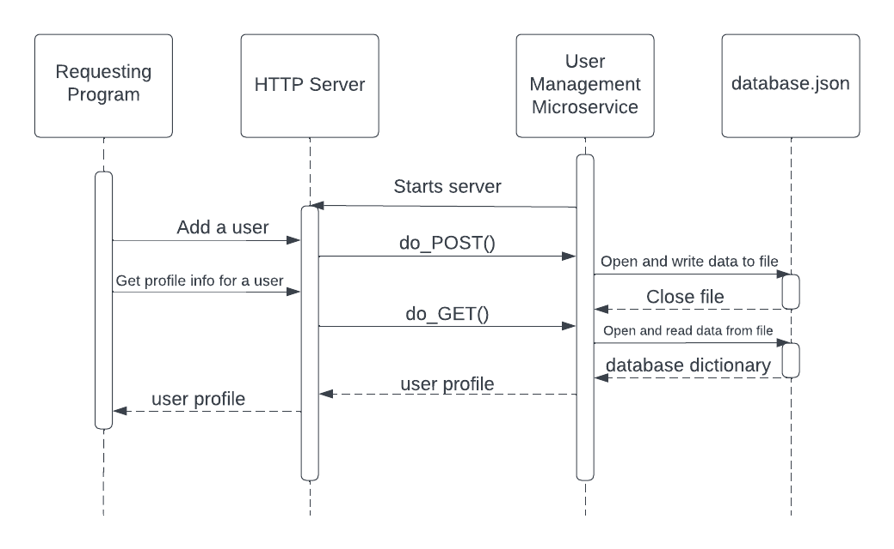

# User Management Microservice
This microservice hosts a local HTTP server to facilitate communication with a storage system. In this case, data will be stored in a file called `store.json` which will be created when the microservice is first ran.
## Installation
Download the `microservice.py`, `demo.py`, and `store.json` files to the same directory. If you don't have Python already installed on your machine, you can install it [here](https://www.python.org/downloads/).

## Running
In the console, navigate to the directory you downloaded the files to. Type `py microservice.py` to start the microservice. The demo can be run in a similar fashion in another console window: `py demo.py`

## Usage
The microservice responds to HTTP requests made on the url http://localhost:8000. There are three paths that are responsive.  
An example request: `GET /users?username=john&password=1234password HTTP/1.1`
### /users
- Add a new user  
`POST /users?username=<USERNAME>&password=<PASSWORD>`
- Get User ID from username/password  
`GET /users?username=<USERNAME>&password=<PASSWORD>`
- Get username/password from User ID  
`GET /users/<USER_ID>`
- Update a username or password  
`PUT /users/<USER_ID>?username=<USERNAME>&password=<PASSWORD>`
- Delete a user  
`DELETE /users/<USER_ID>`
- Get all users  
`GET /users`
### /login
- Gets User ID from username/password  
`POST /login?username=<USERNAME>&password=<PASSWORD>`
### /profiles
- Get user profile info from User ID  
`GET /profiles/<USER_ID>`
- Update user profile info  
`PUT /profiles/<USER_ID>?<PROFILE_ATTRIBUTE>=<ATTRIBUTE>`
- Erase user profile info  
`POST /profiles/<USER_ID>`

## UML Sequence Diagram
